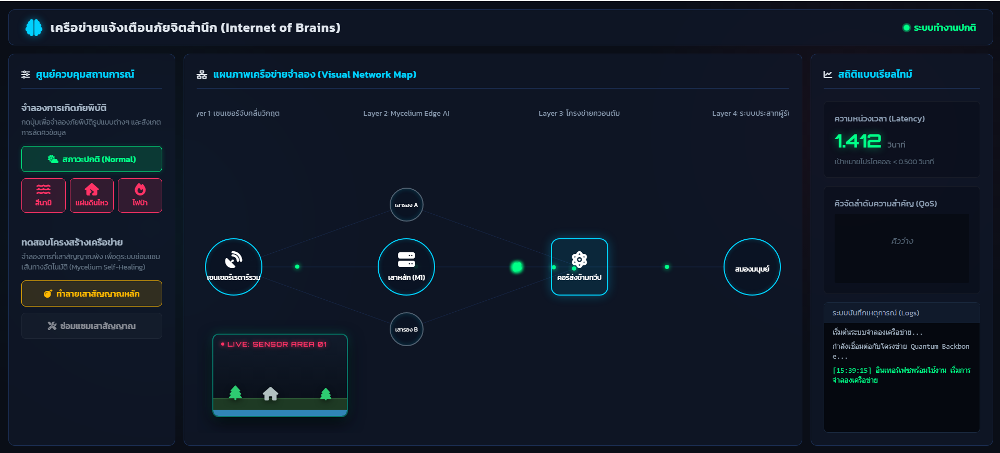

# โครงการ Internet of Brains (ระบบจำลองเครือข่ายเตือนภัยพิบัติผ่าน BCI)
โปรเจคสำหรับรายวิชา **Computer Networks (CP352005)**  
กลุ่มที่ 11  

---

## ผู้จัดทำ (สมาชิกในกลุ่ม)

| รหัสนักศึกษา | ชื่อ-นามสกุล | Section |
|--------------|-------------|--------|
| 673380280-2 | นายปิยะพล ตุ่นป่า | Sec 1 |
| 673380053-3 | นายพีรพัฒน์ ป้องกันยา | Sec 1 |
| 673380042-8 | นายธนันชัย พันธราช | Sec 1 |
| 673380038-9 | นายณัฐพงศ์ กรธนกิจ | Sec 1 |
| 673380048-6 | นายปวัฒน์ ปัดทุมมา | Sec 2 |

---


โปรเจกต์นี้เป็นเว็บแอปพลิเคชันส่วนหน้า (HTML, CSS, JavaScript) ที่แสดงให้เห็นถึงโครงสร้างพื้นฐานการแจ้งเตือนภัยพิบัติ 4 ชั้น (4-layer) ที่ทันสมัยขั้นสูง จุดเน้นของโปรเจกต์คือการลดความหน่วง (Latency) สำหรับการแจ้งเตือนที่สำคัญ, การจัดลำดับความสำคัญของข้อมูลฉุกเฉิน (QoS), และการสาธิตความสามารถในการรักษาตัวเองของเครือข่าย (Self-healing) โดยใช้แนวคิด "Mycelium Edge AI"

## คุณสมบัติหลัก

1. **การจำลองสภาพแวดล้อม (กล้องดูภาพสด)**
   สัมผัสสถานการณ์ภัยพิบัติด้วยภาพจำลองผ่านแผงกล้องดูภาพสดที่มุมซ้ายล่าง
   * **สภาวะปกติ (Normal State)**
   * **สึนามิ (Tsunami):** ระดับน้ำสูงขึ้น, คลื่นซัด, และเซนเซอร์จะเปลี่ยนเป็นทุ่นทะเล (Ocean Buoy) โดยอัตโนมัติ
   * **แผ่นดินไหว (Earthquake):** หน้าจอจะสั่นสะเทือนอย่างรุนแรง, เกิดรอยแยกบนพื้น, และเซนเซอร์จะเปลี่ยนเป็นเซนเซอร์แผ่นดินไหว (Seismic Sensor)
   * **ไฟป่า (Wildfire):** สภาพแวดล้อมเกิดเพลิงไหม้, มีประกายไฟปลิว, และเซนเซอร์จะเปลี่ยนเป็นเซนเซอร์ความร้อน (Thermal Sensor)

2. **การแสดงผลการไหลของเครือข่ายและการจัดลำดับความสำคัญ (QoS)**
   เฝ้าดูแพ็กเก็ตข้อมูลที่กำลังเคลื่อนที่ผ่านสถาปัตยกรรมทั้ง 4 ชั้นอย่างต่อเนื่อง:
   * **ปกติ (แพ็กเก็ตทั่วไป - สีเขียว):** เคลื่อนที่ด้วยความเร็วมาตรฐานพร้อมกับความหน่วงเทียม (Artificial jitter)
   * **วิกฤต (แพ็กเก็ตอันตราย - สีแดง):** ข้ามคิวผ่าน "Neuron-Stream" และเดินทางเร็วขึ้น 3 เท่า ซึ่งแสดงให้เห็นถึงการจัดลำดับความสำคัญคุณภาพการให้บริการ (QoS) ในระดับสูง

3. **เครือข่ายที่สามารถซ่อมแซมตัวเองได้ (Mycelium Self-Healing Network)**
   * คลิก **"ทำลายเสาสัญญาณหลัก"** เพื่อจำลองความล้มเหลวของโครงสร้างเครือข่าย
   * ระบบจะกำหนดเส้นทางใหม่สำหรับแพ็กเก็ตวิกฤตและแพ็กเก็ตปกติทันทีผ่านโหนดสำรองขนาดเล็ก เพื่อรับประกันว่าข้อมูลจะไม่สูญหายและยังคงรักษาการเชื่อมต่อไว้ได้

4. **แดชบอร์ดวัดผลแบบเรียลไทม์**
   * **ตัวติดตามความหน่วง (Latency Tracker)**: แสดงให้เห็นถึงความเร็วในการผ่าน Neuron-Stream (< 0.5 วินาที) เมื่อเปรียบเทียบกับการจัดส่งผ่าน TCP/IP แบบปกติ (1-2 วินาที)
   * **คิว QoS (QoS Queue)**: ดูการรอคิวของการส่งข้อมูลเบื้องหลังมาตรฐานในขณะที่สัญญาณฉุกเฉินสามารถลัดคิวได้
   * **บันทึกระบบ (System Logs)**: ติดตามข้อความการทำงานของระบบเบื้องหลังด้วยภาษาที่เข้าใจง่ายเพื่ออธิบายสถานะปัจจุบัน

## วิธีการใช้งาน

เนื่องจากแอปพลิเคชันนี้ถูกเขียนขึ้นใหม่ทั้งหมดให้ทำงานบนฝั่งไคลเอนต์เท่านั้น (Vanilla JS) จึง *ไม่จำเป็นต้องติดตั้งเซิร์ฟเวอร์*

1. ดับเบิลคลิกไฟล์ `index.html` เพื่อเปิดในเว็บเบราว์เซอร์ยุคใหม่
2. การจำลองจะเริ่มต้นขึ้นทันที
3. ใช้ **ศูนย์ควบคุม (แผงควบคุมด้านซ้าย)** เพื่อกระตุ้นเหตุการณ์ต่างๆ และอธิบายสถาปัตยกรรมของคุณแบบโต้ตอบ

## สถาปัตยกรรมระบบทั้ง 4 ชั้นที่นำเสนอ

1. **Layer 1: เซนเซอร์จับคลื่นวิกฤต (Sensors):** อุปกรณ์ปลายทาง (Edge devices) ทำหน้าที่รวบรวมข้อมูลความผิดปกติของสภาพแวดล้อม รวมถึงการเปลี่ยนไอคอนแบบไดนามิกตามภัยพิบัติที่เกิดขึ้น
2. **Layer 2: Mycelium Edge AI:** โหนดตัวกลางสำหรับกำหนดเส้นทาง ซึ่งสามารถซ่อมแซมตัวเองได้โดยอัตโนมัติและจัดลำดับความสำคัญของแพ็กเก็ตอย่างรวดเร็ว
3. **Layer 3: โครงข่ายควอนตัม (Quantum Backbone):** โครงข่ายหลักระยะไกล ซึ่งรองรับปริมาณข้อมูลมหาศาลข้ามทวีปได้อย่างมีประสิทธิภาพ
4. **Layer 4: ระบบประสาทผู้รับ (Brain / Receiver):** สถานีเชื่อมต่อสมองกับคอมพิวเตอร์ (BCI) ปลายทางที่ก้าวข้ามกำแพงด้านภาษาและส่งมอบการแจ้งเตือนโดยตรง

## เทคโนโลยีที่ใช้
* **HTML5**: โครงสร้างแบบ Semantic web
* **Vanilla JavaScript (ES6)**: แอนิเมชันบน Canvas (การเรนเดอร์แพ็กเก็ต), การจัดการสถานะ, การจัดการ DOM, การคำนวณคิวและความหน่วง
* **Modern CSS3**: ตัวแปร CSS แบบไดนามิก, การเปลี่ยนผ่าน UI ที่ลื่นไหล, สไตล์ Glassmorphism, และการใช้ Keyframe animations เพื่อสร้างเอฟเฟกต์ภัยพิบัติ
* **FontAwesome 6**: ไลบรารีอเนกประสงค์สำหรับไอคอน UI ที่ดูเรียบง่ายและสื่อความหมายได้ดี
* **Google Fonts**: ใช้ฟอนต์ `Kanit` และ `Orbitron` เพื่อให้ดูสะอาดตา อ่านง่าย แต่ยังคงความรู้สึกล้ำยุคเล็กน้อย

## การเชื่อมต่อข้อมูลจริง (Real Data Integration)

เพิ่มโหมด "real-data" เพื่อให้โปรเจกต์ไม่ใช่แค่ระบบทดสอบ:

1. สร้างไฟล์ `data/real_data.json` (ตัวอย่าง JSON อยู่ใน repo) หรือรัน Python script:

```bash
python -m pip install requests
python python/fetch_real_data.py
```

2. รัน FastAPI server (realtime API):

```bash
python -m pip install fastapi uvicorn
uvicorn python.realtime_server:app --reload --host 0.0.0.0 --port 8000
```

3. `app.js` จะโหลดข้อมูลจาก API `/api/realtime` และสลับไปใช้ `data/real_data.json` (fallback) ถ้า service ไม่พร้อม

4. `app.js` มีการตรวจจับ (polling) ทุก 20 วินาที เพื่อดึงข้อมูลใหม่อย่างเรียลไทม์ (live refresh)

5. หากไม่มีเซิร์ฟเวอร์หรือโหลดล้มเหลว จะกลับมาทำงานที่โหมดทดสอบ (Demo mode) ตามเดิม

6. ปรับค่าใน `app.js` ที่ตัวแปร `isRealDataMode` เป็น `false` หากต้องการทดสอบเฉพาะระบบจำลองเท่านั้น

## ตัวอย่างการเรียกใช้งาน (Workflow)

* Sensor -> Edge -> Backbone -> Brain
* ภัยพิบัติ (Danger event) จาก real_data.json จะถูกแทนที่เป็นแพ็กเก็ต DANGER (ความสำคัญระดับ 100)
* เหตุการณ์อัปเดตปกติ (Normal event) จะถูกส่งเป็นแพ็กเก็ต NORMAL (ความสำคัญระดับ 10)
* คิว QoS ใช้คิวลำดับความสำคัญแบบเดียวกับโครงงาน

## รายการตรวจสอบการทำงาน (Verification Checklist)

1. ตรวจสอบว่ามีไฟล์ข้อมูลล่าสุด
   * รันคำสั่ง `python python/fetch_real_data.py` (จะได้ไฟล์ `data/real_data.json`)
   * สังเกตผลลัพธ์ว่ามีข้อความ `บันทึก 120 เรคอร์ดลง ...` (หรือจำนวนใกล้เคียง)
2. รันบริการ FastAPI
   * รันคำสั่ง `python -m pip install fastapi uvicorn`
   * รันคำสั่ง `uvicorn python.realtime_server:app --reload --host 0.0.0.0 --port 8000`
3. ตรวจสอบ API โดยตรง
   * เปิดลิงก์ http://localhost:8000/api/realtime
   * ควรเห็นการตอบกลับเป็น JSON รูปแบบ `{ "timestamp": ..., "count": ..., "events": [...] }`
4. เปิดเว็บ UI
   * เข้าเว็บเบราว์เซอร์ไปที่ http://localhost/Disater-waining-demo-/index.html
   * ตรวจสอบบันทึกการทำงาน (log) ในเบราว์เซอร์ว่าแสดงข้อความ `โหลดข้อมูลจริงจาก API /api/realtime สำเร็จ` หรือ `fallback data/real_data.json`
5. ถ้าไม่ต้องการเปิดหน้าต่าง terminal ทิ้งไว้ตลอดเวลา สามารถตั้งค่าเป็น Windows service หรือใช้สคริปต์ `run_realtime.bat`

## การใช้งานหลังจากตั้งค่าเสร็จสิ้น

* รันสคริปต์ทุกครั้งก่อนเริ่มการสาธิต
  * รันคำสั่ง `python python/fetch_real_data.py`
* ตรวจสอบสถานะเครือข่าย (ความหน่วง, QoS, การซ่อมแซมตัวเอง) ผ่านหน้า UI
* เก็บภาพหน้าจอสถานะและรูปแบบการไหลของเครือข่าย เพื่อนำไปใช้สำหรับรายงานส่งอาจารย์

<p align="center">

</p>

## ลิงก์อ้างอิง

- วิดีโอสาธิต: https://kku.world/vdonetwork
- NotebookLM: https://notebooklm.google.com/notebook/dd78cf01-5c52-4ca6-b505-042d661a80ff?authuser=3&pageId=none
